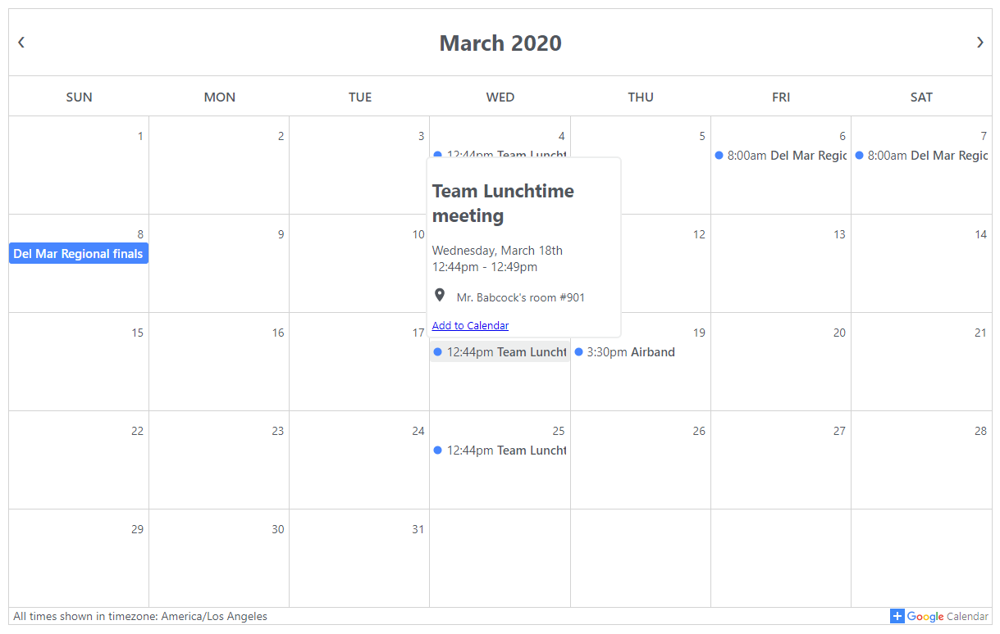

# React Google Calendar

 [](https://travis-ci.com/ericz1803/react-google-calendar)   
  
A react component that displays an event calendar using data from google's calendar api. It is intended to replace the embedded google calendar.

It handles reccuring events, deleted events, and changed events. It also handles and displays events of all lengths in a very similar way to google calendar and supports multiple calendars. All events are displayed in the user's timezone.

See it in action [here](https://ericz1803.github.io/react-test-calendar/) or try it yourself in CodeSandbox [here](https://codesandbox.io/s/kind-davinci-12qze).



Design inspired by [this calendar](https://codepen.io/knyttneve/pen/QVqyNg) and [Google Calendar](https://www.google.com/calendar). Icons from [Material Design](https://material.io/resources/icons/?style=baseline).

## Installation

```
1. npm install --save react react-dom @emotion/react
2. npm install --save @ericz1803/react-google-calendar
```

## Usage

First, get an api key from [here](https://developers.google.com/calendar/quickstart/js) by following step 1.

Alternately, you can go to https://console.developers.google.com/flows/enableapi?apiid=calendar.

Then, get the calendar id from the google calendar. It will look something like `09opmkrjova8h5k5k46fedmo88@group.calendar.google.com`.   
You can find it by going to a calendar's settings and scrolling down to the section that is labelled `Integrate calendar`.

### Basic Example

```js
import React from "react";
import Calendar from "@ericz1803/react-google-calendar";

const API_KEY = "YOUR_API_KEY";
let calendars = [
  {calendarId: "YOUR_CALENDAR_ID"},
  {
    calendarId: "YOUR_CALENDAR_ID_2",
    color: "#B241D1" //optional, specify color of calendar 2 events
  }
];

class Example extends React.Component {
  render() {
    return (
      <div>
        <Calendar apiKey={API_KEY} calendars={calendars} />
      </div>
    )
  }
}
```

### Properties
| Parameter     | Type             | Description                                                                     |
|---------------|------------------|---------------------------------------------------------------------------------|
| `apiKey`      | string           | google api key (required)                                                       |
| `calendars`   | array of objects | google calendar id and display color (required)                                 |
| `styles`      | object           | styles (optional, see more below)                                               |
| `showArrow`   | boolean          | shows arrow for events that span multiple months (optional, defaults to `true`) |
| `showFooter`  | boolean          | whether or not to show footer (optional, defaults to `true`)                    |
| `language`    | string           | Available options : 'ES', 'PT', 'FR', default: 'EN'                             |

### Customization

You can customize the color of each calendar's events by specifying a color field with the calendar id (see examples).

To customize other aspects of the calendar (eg. borders, colors of the calendar), pass in a `styles` object. Each of the styles in the `styles` object should be an object style (the same as react inline styles) or an emotion `css` string style ([see more here](https://emotion.sh/docs/css-prop)). If you choose to use emotion's `css` string styles, make sure to `import { css } from "@emotion/react"`.

#### Style Keys
- `calendar`
- `day`
- `today`
- `tooltip`
- `event`
- `eventText`
- `eventCircle`
- `multiEvent`

### Example With Customization

```js
import React from "react";
import Calendar from "@ericz1803/react-google-calendar";
import { css } from "@emotion/react";

const API_KEY = "YOUR_API_KEY";
let calendars = [
  {calendarId: "09opmkrjova8h5k5k46fedmo88@group.calendar.google.com", color: "#B241D1"}, //add a color field to specify the color of a calendar
  {calendarId: "hkr1dj9k6v6pa79gvpv03eapeg@group.calendar.google.com"}, //without a specified color, it defaults to blue (#4786ff)
  {calendarId: "rg4m0k607609r2jmdr97sjvjus@group.calendar.google.com", color: "rgb(63, 191, 63)"} //accepts hex and rgb strings (doesn't work with color names)
];

let styles = {
  //you can use object styles (no import required)
  calendar: {
    borderWidth: "3px", //make outer edge of calendar thicker
  },
  
  //you can also use emotion's string styles
  today: css`
   /* highlight today by making the text red and giving it a red border */
    color: red;
    border: 1px solid red;
  `
}

const language = 'ES';

class Example extends React.Component {
  render() {
    return (
      <div>
        <Calendar 
        apiKey={API_KEY} 
        calendars={calendars} 
        styles={styles} 
        language={language}
        />
      </div>
    )
  }
}
```

## License
MIT License
